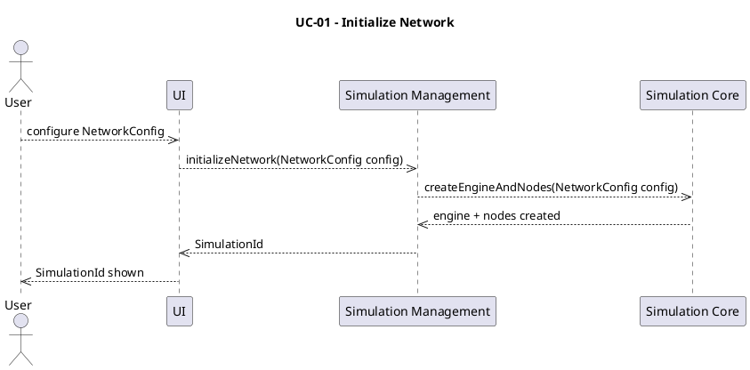
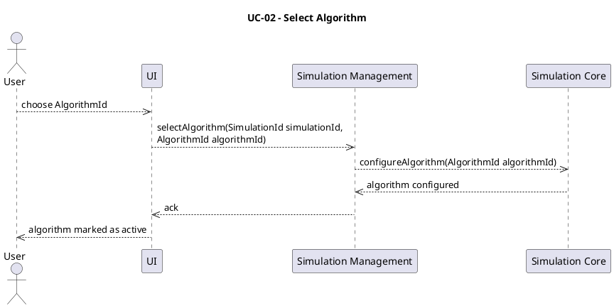
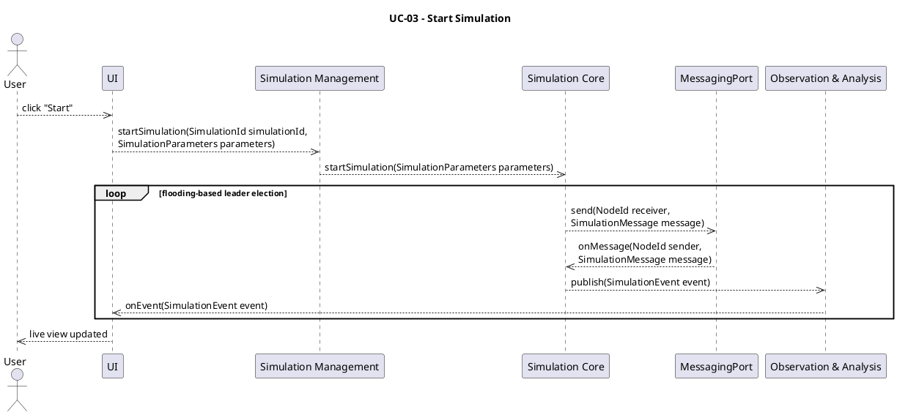
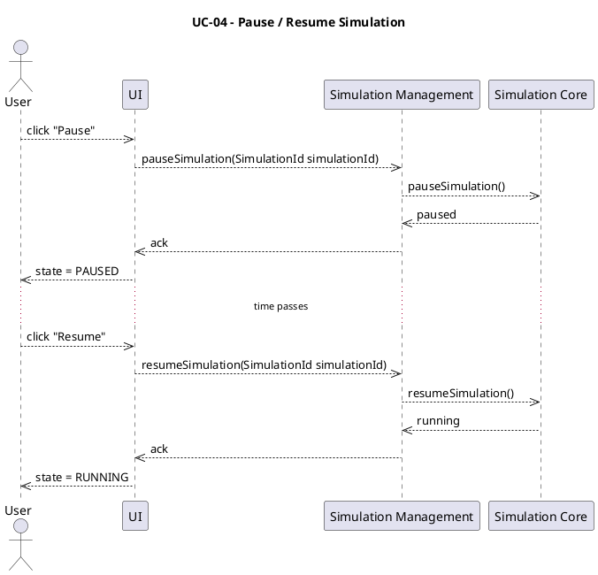
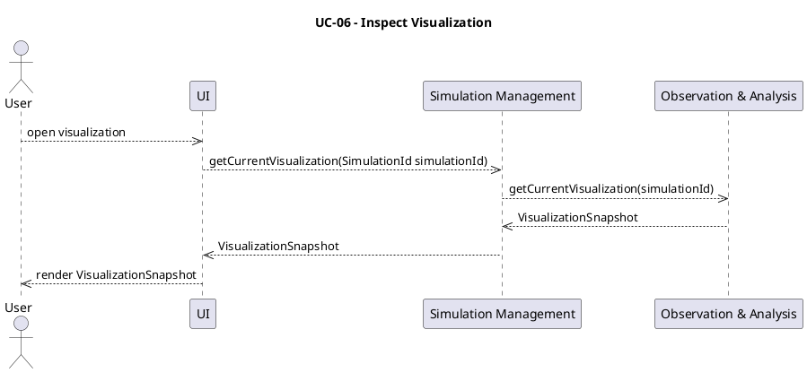
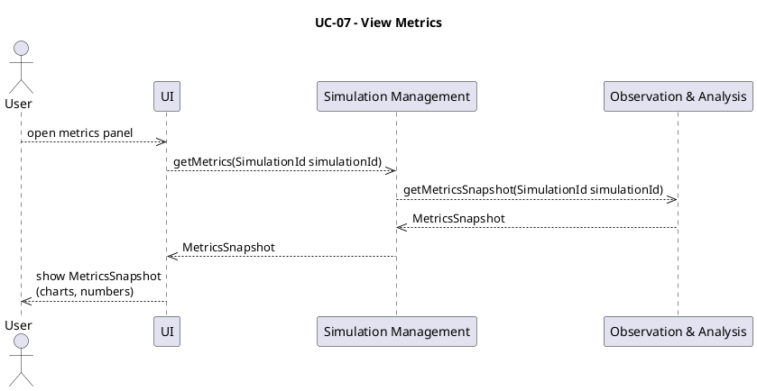
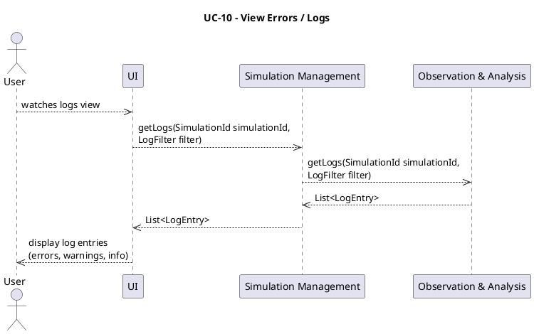
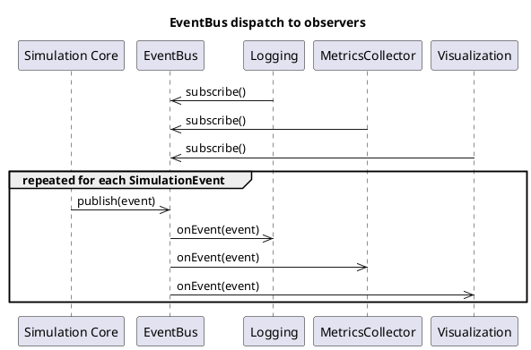

```plantuml
@startuml
title UC-01 - Initialize Network

actor User
participant UI
participant "Simulation Management" as SimulationManagement
participant "Simulation Core" as SimulationCore

User -->> UI : configure NetworkConfig
UI -->> SimulationManagement : initializeNetwork(NetworkConfig config)
SimulationManagement -->> SimulationCore : createEngineAndNodes(NetworkConfig config)
SimulationCore -->> SimulationManagement : engine + nodes created
SimulationManagement -->> UI : SimulationId
UI -->> User : SimulationId shown

@enduml
```

```plantuml
@startuml
title UC-02 - Select Algorithm

actor User
participant UI
participant "Simulation Management" as SimulationControl
participant "Simulation Core" as SimulationEngine

User -->> UI : choose AlgorithmId
UI -->> SimulationControl : selectAlgorithm(SimulationId simulationId,\nAlgorithmId algorithmId)
SimulationControl -->> SimulationEngine : configureAlgorithm(AlgorithmId algorithmId)
SimulationEngine -->> SimulationControl : algorithm configured
SimulationControl -->> UI : ack
UI -->> User : algorithm marked as active

@enduml
```

```plantuml
@startuml
title UC-03 - Start Simulation

actor User
participant UI
participant "Simulation Management" as SimulationManagement
participant "Simulation Core" as SimulationCore
participant "MessagingPort" as Middleware
participant "Observation & Analysis" as Observation

User -->> UI : click "Start"
UI -->> SimulationManagement : startSimulation(SimulationId simulationId,\nSimulationParameters parameters)
SimulationManagement -->> SimulationCore : startSimulation(SimulationParameters parameters)

loop flooding-based leader election
    SimulationCore -->> Middleware : send(NodeId receiver,\nSimulationMessage message)
    Middleware -->> SimulationCore : onMessage(NodeId sender,\nSimulationMessage message)
    SimulationCore -->> Observation : publish(SimulationEvent event)
    Observation -->> UI : onEvent(SimulationEvent event)
end

UI -->> User : live view updated

@enduml
```

```plantuml
@startuml
title UC-04 - Pause / Resume Simulation

actor User
participant UI
participant "Simulation Management" as SimulationManagement
participant "Simulation Core" as SimulationCore

User -->> UI : click "Pause"
UI -->> SimulationManagement : pauseSimulation(SimulationId simulationId)
SimulationManagement -->> SimulationCore : pauseSimulation()
SimulationCore -->> SimulationManagement : paused
SimulationManagement -->> UI : ack
UI -->> User : state = PAUSED

... time passes ...

User -->> UI : click "Resume"
UI -->> SimulationManagement : resumeSimulation(SimulationId simulationId)
SimulationManagement -->> SimulationCore : resumeSimulation()
SimulationCore -->> SimulationManagement : running
SimulationManagement -->> UI : ack
UI -->> User : state = RUNNING
@enduml
```

```plantuml
@startuml
title UC-06 - Inspect Visualization

actor User
participant UI
participant "Simulation Management" as SimulationManagement
participant "Observation & Analysis" as Analysis

User -->> UI : open visualization
UI -->> SimulationManagement : getCurrentVisualization(SimulationId simulationId)
SimulationManagement -->> Analysis : getCurrentVisualization(simulationId)
Analysis -->>SimulationManagement : VisualizationSnapshot
SimulationManagement -->> UI : VisualizationSnapshot
UI -->> User : render VisualizationSnapshot
@enduml
```

```plantuml
@startuml
title UC-07 - View Metrics

actor User
participant UI
participant "Simulation Management" as SimulationControlService
participant "Observation & Analysis" as Observation

User -->> UI : open metrics panel
UI -->> SimulationControlService : getMetrics(SimulationId simulationId)
SimulationControlService -->> Observation : getMetricsSnapshot(SimulationId simulationId)
Observation -->> SimulationControlService : MetricsSnapshot
SimulationControlService -->> UI : MetricsSnapshot
UI -->> User : show MetricsSnapshot\n(charts, numbers)
@enduml
```

```plantuml
@startuml
title UC-10 - View Errors / Logs

actor User
participant UI
participant "Simulation Management" as SimulationManagement
participant "Observation & Analysis" as Observation

User -->> UI : watches logs view
UI -->> SimulationManagement : getLogs(SimulationId simulationId,\nLogFilter filter)
SimulationManagement -->> Observation : getLogs(SimulationId simulationId,\nLogFilter filter)
Observation -->> SimulationManagement : List<LogEntry>
SimulationManagement -->> UI : List<LogEntry>
UI -->> User : display log entries\n(errors, warnings, info)
@enduml
```

```plantuml
@startuml
title EventBus dispatch to observers
participant Core as "Simulation Core"
participant Bus  as "EventBus"
participant Log  as "Logging"
participant Met  as "MetricsCollector"
participant Viz  as "Visualization"

Log ->> Bus: subscribe()
Met ->> Bus: subscribe()
Viz ->> Bus: subscribe()

group repeated for each SimulationEvent
Core ->> Bus: publish(event)
Bus  ->> Log: onEvent(event)
Bus  ->> Met: onEvent(event)
Bus  ->> Viz: onEvent(event)
end

@enduml
```